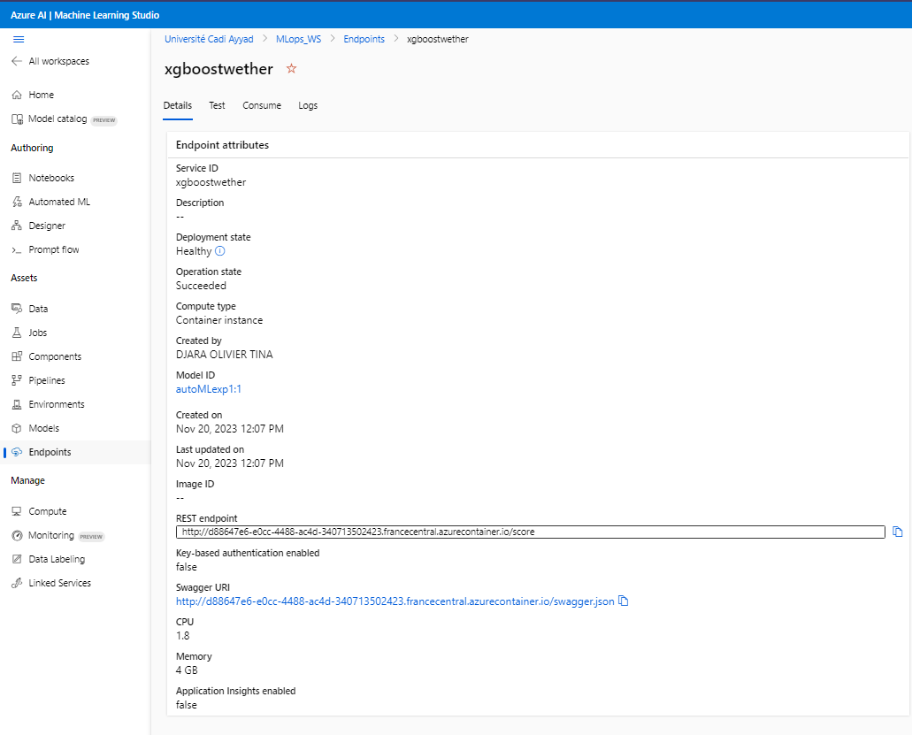
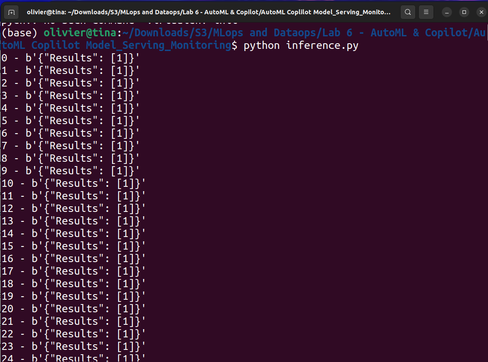
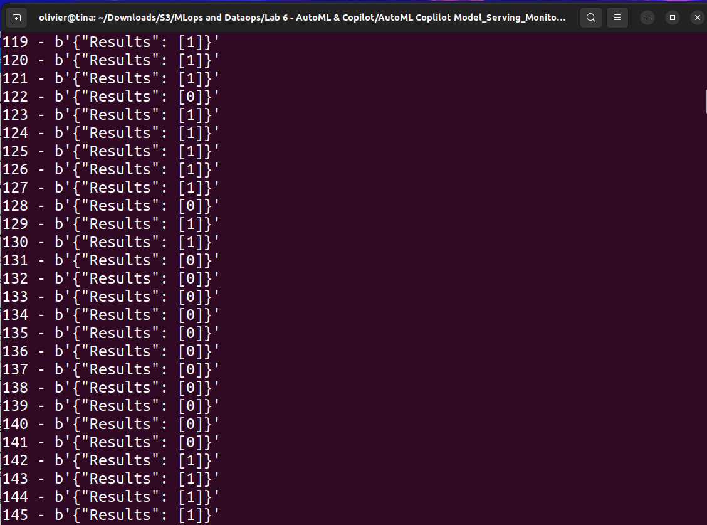
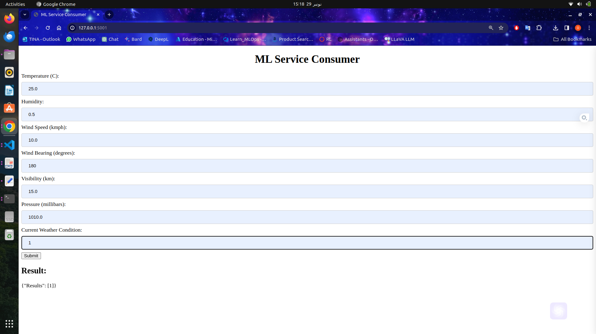

# AutoML-Coplilot-Model_Serving_Monitoring

This repository contains the source code and associated resources for our project, utilizing Azure AutoML to create a model, deploying it as a service, and building a web application to consume this service.

## Steps to Reproduce

### 1. Create the Model with AutoML on Azure

- Use Azure AutoML to create your model following the necessary steps.
- Make sure to document parameters, performance metrics, and other crucial information.

### 2. Deploy the Model

- Deploy the model and take note of the generated endpoint.
  
#### Screenshot - deployed model and end-point

### 3. Local Testing

- Test the endpoint on the provided example inference data (`sample_inference_data`).

#### Screenshot - Local inference 1

#### Screenshot - Local inference 2

### 4. Build the Web Application

- Develop a web application to consume the deployed service.

### 5. Deployment of the API as a Container

- Deploy the API as a container for easier integration.

#### Screenshot - Web app for prediction

## Required Configuration

- List of necessary software and hardware dependencies.
